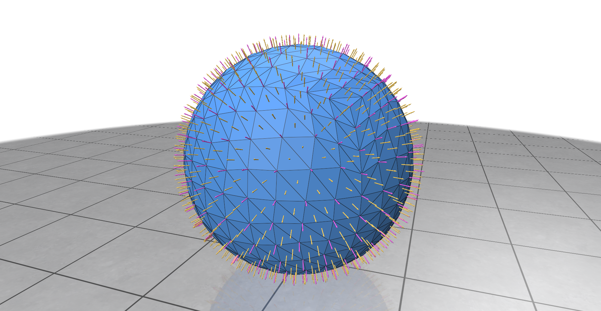
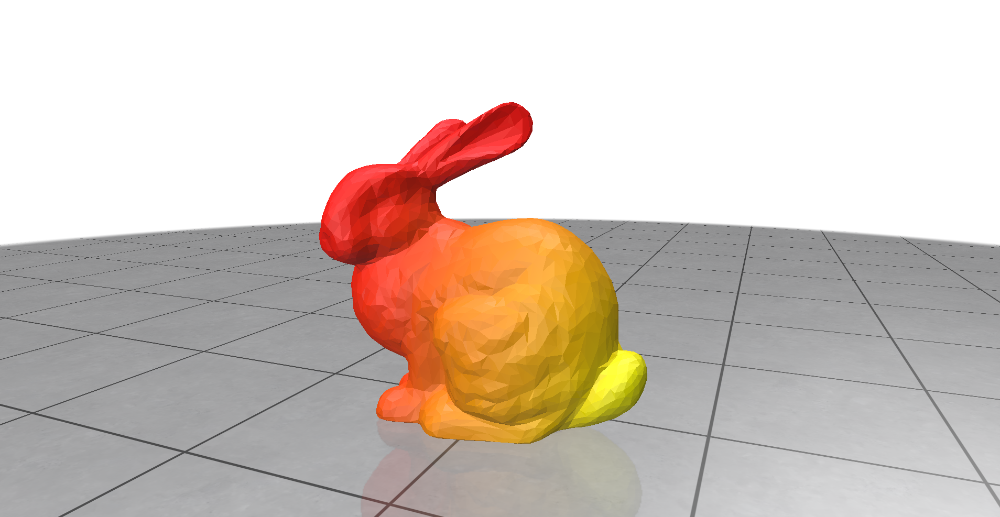

# GPU Geometry Processing

Applications of GPU-accelerated triangle mesh processing using RXMesh, a library for processing triangle meshes entirely on the GPU.

Built off the RXMeshApp template, applications of the RXMesh library for processing face normals, vertex normals, and heat diffusion are included to test the functionality of the RXMesh library.

---

## Applications

### Face and Vertex Normals



- Face normals in yellow, vertex normals in pink

### Heat Diffusion



- Normalized heatmap coloring, with yellow as  max heat at the source

---

## Build

To configure and build:

```bash
mkdir build
cd build
cmake ..
```
This generates a `.sln` file on Windows or a Makefile on Linux. You can control rendering support using the `RX_USE_POLYSCOPE` option:

```bash
cmake -DRX_USE_POLYSCOPE=ON ..
```

Set it to `OFF` to disable [Polyscope](https://polyscope.run/).


---

## Notes

- You may want to rename the project in `CMakeLists.txt` and refactor the folder name accordingly.

- CI runs on Windows and Ubuntu using GitHub Actions.

### 📘 Documentation: [RXMesh Docs](https://ahdhn.github.io/RXMeshDocs//)

- Some deprecated CUDA functionality updated from 11.0+ to 13.0+ on a fork of the original library.